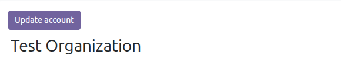
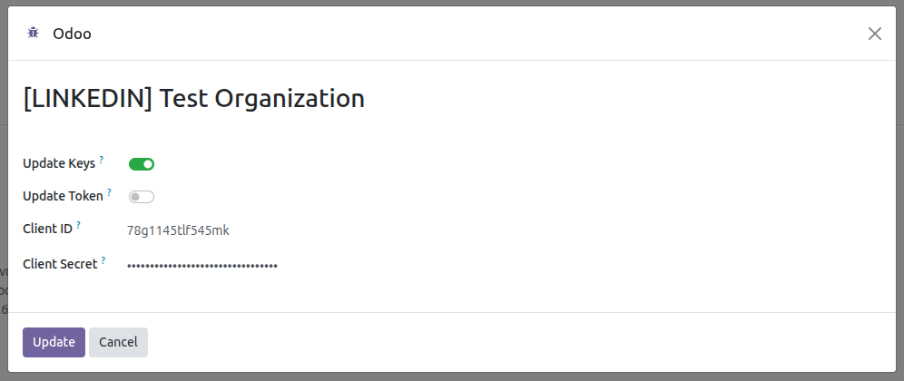
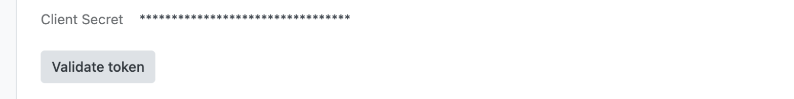
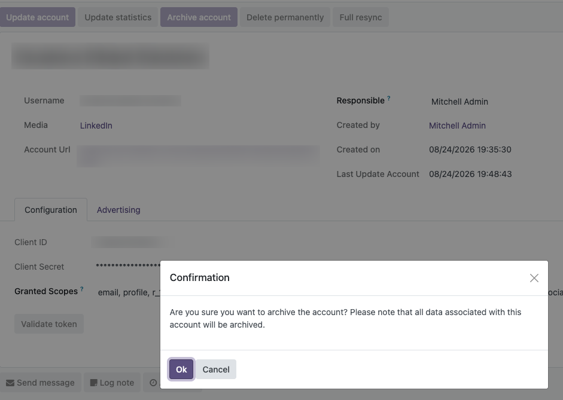

List of posts generated from Odoo.
---------------

Only posts generated using Odoo are displayed.

- Go to *Social Media* > Posts

Generate a post.
---------------

This feature acts as a template for generating multiple posts
from a single view, depending on the selected accounts.

- Go to *Social Media* > Posts > New or Go to *Social Media* > Dashboard > Add Post
- Fill in the required fields
- When the post is created, every LinkedIn account of the active company is
  selected by default in *Accounts*; remove the ones you do not want to use
  before publishing.
  
- Save
- Click on the *Post* button
- LinkedIn publishes either images or a video, never both: when the post
  carries a video, its images are left out. The preview of the post says so
  by showing the video alone, so what is previewed is what LinkedIn
  receives, and a banner on the form explains it as well.
- A publication shares the images and the video of its post, so the dashboard
  card shows them as soon as LinkedIn accepts the post and nothing else has to
  run. What LinkedIn made of each media is recorded on the publication, which
  is what lets an image deleted on LinkedIn leave the card while the one in the
  post stays; noticing that deletion needs *Social Media LinkedIn Sync*.

Update token, client ID, client Secret and organization data
---------------

- Go to *Social Media* > Configuration > Accounts
- Select the account
- Click on the *Update account* button

  

- In the wizard that appears, if none of the checkboxes are selected and the
  *Update* button is pressed, the system will update only the organization's data.
- If the *Update keys* checkbox is selected, the current Client ID is proposed
  to the administrator users, the only ones allowed to read it, and the Client
  Secret has to be typed again: the stored secret is never sent to the browser.
  Authentication is then performed again through LinkedIn, and the keys are
  only written on the account once LinkedIn has accepted them, so an
  authorization left halfway keeps the credentials that still work.

  

- Selecting the *Update token* checkbox will update the current token.

  

Validate the token
---------------

- Go to *Social Media* > Configuration > Accounts
- Select the account and open the *Configuration* tab
- Click on the *Validate token* button. It always asks LinkedIn whether the
  token is still active, because a token can be revoked there long before
  the stored expiry dates: a notification confirms that it is valid, and if
  it is not, the token is renewed. Outside the renewal window, the check made
  before every call to LinkedIn uses the stored dates, so it costs no extra
  request.

  

Archive Account Linkedin
----------------------------

- Go to *Social Media* > Configuration > Accounts
- Select the account
- Click on the *Archive account* button

  

- Please note that all data associated with this account will be archived.
- If you associate the same LinkedIn account again later, the archived
  account and its related data will be reactivated instead of creating a
  duplicate.
- An archived account can be deleted permanently with the *Delete
  permanently* button, only available to a social media administrator. The
  LinkedIn publications stay online, only the Odoo history is removed.

Uninstalling the module
----------------------------

Uninstalling *Social Media Linkedin* does not delete the accounts nor their
publication history:

- The access token and the refresh token are cleared, so no credential
  outlives the module.
- The LinkedIn accounts are archived, together with their posts.
- The LinkedIn specific data is lost, because Odoo drops the columns of an
  uninstalled module: the application Client ID and Client Secret.
- The identifier of each account and publication on LinkedIn is kept, so
  installing the module back and associating the account again reactivates
  the archived history and updates it, instead of importing everything as
  duplicated records.

Time series of the account
---------------

- LinkedIn is asked for its figures **by day**, with the
  [`organizationalEntityShareStatistics`](https://learn.microsoft.com/en-us/linkedin/marketing/community-management/organizations/share-statistics)
  finder and `timeGranularityType=DAY`, and every bucket it answers becomes
  one row of *Social Media* > Statistics. Nothing is invented for the days it
  reports nothing for.
- Right after the account is linked, the rewrite window is read and the whole
  period LinkedIn reports is asked for straight after, so the card of the
  dashboard is filled with the year and not only with the last days. No
  synchronization module is needed for that.
- The finder answers at most 100 daily buckets per call and does not paginate,
  so a period wider than that is asked for in several calls, one after
  another, instead of coming back cut at the hundredth day.
- The whole period is read only once. It is then skipped, because the rewrite
  window is the only thing written on every pass and a row older than it can
  only come from that first reading. If it failed --LinkedIn refused the call,
  the token had just been issued-- the *Rebuild statistics history* button of
  the account form asks for it again.
- The last week is asked for again on every pass of the two-hourly check,
  and by the *Update statistics* button of the account form. LinkedIn
  revises figures of days already past, so the recent ones are rewritten
  instead of being trusted as final; the days before that window stay as
  they were left.
- The *Rebuild statistics history* button asks LinkedIn for the daily figures
  of the page again, as far back as it reports them, and rewrites the time
  series with them. It **does not import publications**: what it rebuilds is
  the graph of the account. Bringing in the publications themselves is what
  *Social Media LinkedIn Sync* does.
- An account whose statistics LinkedIn refuses is reported and skipped, and
  the rest of the accounts keep the rows already written for them.
- The account is asked for its organization page as a whole, which includes
  what was published before Odoo managed the account or outside of it. The
  figures are therefore not the sum of what Odoo imported and are not meant
  to be compared against it.

LinkedIn tokens
---------------

- The access token of LinkedIn lasts two months and its refresh token a year,
  as stated in the
  [refresh tokens documentation](https://learn.microsoft.com/en-us/linkedin/shared/authentication/programmatic-refresh-tokens).
  Within the week before the expiry date, and on every run of the scheduled
  action *Social: Checking social media updates* and before publishing, Odoo
  asks LinkedIn whether the token is still active (`introspectToken` endpoint)
  and only renews it when LinkedIn answers that it is not. Outside of that
  window the check is answered with the stored dates and costs no request.
  Nothing has to be done for a post planned weeks ahead.
- If LinkedIn refuses the token anyway, it is renewed and the publication is
  sent again straight away.
- Once the refresh token expires, or the authorization is revoked from
  LinkedIn, no renewal is possible: the account shows the update warning and
  has to be authorized again with *Update account*, which is the only step
  that needs the browser.

LinkedIn limits and validations
---------------

- The text of the post is **not** checked in Odoo: the `commentary` field of
  the
  [Posts API](https://learn.microsoft.com/en-us/linkedin/marketing/community-management/shares/posts-api)
  limits the body of a publication to 3.000 characters. A longer text fails
  when it is sent and the line is left as *Failed* with the validation error
  LinkedIn answers, so check the length before publishing.
- The number of images is not checked either: one image is published as a
  single image and two or more as a
  [multi-image post](https://learn.microsoft.com/en-us/linkedin/marketing/community-management/shares/multiimage-post-api).
  Its limits are applied by LinkedIn when it receives the post, so a number of
  images it does not accept is only detected when publishing.
- LinkedIn publishes **JPG, PNG and GIF** images and **MP4** videos. Any other
  format is announced on the post as soon as it is attached and refuses the
  publication of that line, which is left as *Failed* naming the file. The
  images are only checked when the post carries no video, because a video
  leaves them out anyway.
- Every call to LinkedIn has a timeout of **10 seconds**, not configurable. If
  LinkedIn or the connection take longer, the operation fails with *Error
  connecting to LinkedIn* and has to be retried; a publication is left as
  *Failed* and can be sent again with the *Post* button.
- An account without an access token does not publish: this is what happens
  after uninstalling and installing the module back, which clears the
  credentials. The line is left as *Failed* stating that the account has no
  access token, and the account shows the update warning. Authorize it again
  with *Update account*.
- The
  [Reactions API](https://learn.microsoft.com/en-us/linkedin/marketing/community-management/shares/reactions-api)
  only accepts **one reaction per account**: liking a publication that was
  already liked answers *You have already reacted to this post.*, and the
  reaction cannot be withdrawn from Odoo. If the publication was deleted on
  LinkedIn, the message is *The post does not exist or has been deleted.*
- *Recommend* also works on a comment, with the same endpoint and the same
  permissions: a reaction is created on the comment itself instead of on the
  publication. The answers are the equivalent ones, *You have already reacted
  to this comment.* and *The comment does not exist or has been deleted.*
  Only *Like* is sent; the other reactions LinkedIn offers, *Celebrate*,
  *Love*, *Insightful*, *Support* and *Funny*, are not offered from Odoo, and
  a reaction on a comment cannot be withdrawn from Odoo either.
- A comment is addressed by a composite reference, the thread it lives on plus
  its own identifier, `urn:li:comment:(urn:li:activity:6666,120381273128)`.
  LinkedIn does not always answer it, so it is built from the thread the
  comment reports. A comment that arrives with neither of the two cannot be
  recommended, and the action says *The comment cannot be recommended on
  LinkedIn.* instead of calling LinkedIn.
- Deleting a publication from the dashboard deletes it on LinkedIn first. If
  LinkedIn does not confirm the deletion, the operation is cancelled with
  *Error deleting LinkedIn post* and the record is kept in Odoo, so the two
  sides never get out of sync.

Video upload
---------------

- LinkedIn decides how a video is split: `initializeUpload` answers one
  instruction per part, of 4 MiB each except the last one, and every part is
  uploaded with its own request. The identifiers LinkedIn returns for the
  parts are sent back to `finalizeUpload` in the same order, so the video is
  put together as it was cut. A 22 MB video takes 6 parts and around 25
  seconds, upload and processing included.

  https://learn.microsoft.com/en-us/linkedin/marketing/community-management/shares/videos-api

- A post publishes a single video, so a post carrying several is refused
  before uploading anything: LinkedIn would only keep the first one and the
  others would be transferred and processed for nothing.
- LinkedIn processes an uploaded video before it can be published, so
  publishing a post with a video waits until the video is available. The wait
  is tuned with the `social_media_linkedin.video_poll_attempts` and
  `social_media_linkedin.video_poll_delay` system parameters, 30 attempts
  every 2 seconds by default. A long video may need more than that.
- The video of a published post is not attached to the publication itself:
  only the *has video* flag is kept, and the dashboard shows a camera icon.
  The video stays available on the post it was published from.

Publishing options
---------------

- Every publication is created **public**, in the main feed, with no targeting
  by country, language or industry, and letting it be shared: `visibility`,
  `feedDistribution`, `targetEntities` and `thirdPartyDistributionChannels`
  are fixed in the code.
- Scheduling is not delegated to LinkedIn either: the Odoo scheduled action is
  the one that publishes when the date arrives.

  https://learn.microsoft.com/en-us/linkedin/marketing/community-management/shares/posts-api

Errors reported by LinkedIn
---------------

- When LinkedIn rejects a request because of its content, its answer only
  says that the validation failed and lists the rejected fields apart, in
  the shape described in its
  [error handling guide](https://learn.microsoft.com/en-us/linkedin/shared/api-guide/concepts/error-handling).
  Those explanations are the ones shown in Odoo, one per line, so the
  message names the field and the rule that was broken instead of the
  generic summary.
