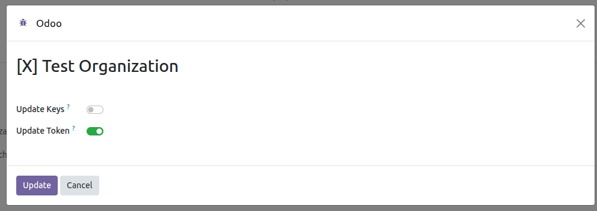

List of posts generated from Odoo.
---------------

Only posts generated using Odoo are displayed.

- Go to *Social Media* > Post

Generate a post.
---------------

This feature acts as a template for generating multiple posts
from a single view, depending on the selected accounts.

- Go to *Social Media* > Post > New or Go to *Social Media* > Dashboard > Add Post
- Fill in the required fields
- When the post is created, every X account of the active company is selected
  by default in *Accounts*; review the list and remove the ones you do not want
  to use before saving.
- Save
- Click on the *Post* button
- A publication shares the images and the video of its post, so the dashboard
  card shows them, and its video indicator, as soon as X accepts the message.
  Nothing waits for an import.

Update token, API Key, API Secret and account data
---------------

- Go to *Social Media* > Configuration > Accounts
- Select the account
- Click on the *Update account* button

  

- In the wizard that appears, if none of the checkboxes are selected and the
  *Update* button is pressed, the system will update only the account's data.
- If the *Update keys* checkbox is selected, the current API Key and API Secret
  values will be displayed by default. Modify any of these values and authentication
  will be performed again through X to update these values and the token.

  

- Selecting the *Update token* checkbox will update the current token.

  

Archive Account X
----------------------------
- Go to *Social Media* > Configuration > Accounts
- Select the account
- Click on the *Archive account* button
- Please note that all data associated with this account will be archived.
- To use an archived account again, open it in *Social Media* > Configuration >
  Accounts (*Archived* filter) and press *Unarchive account*: the account and
  its data are restored instead of creating a duplicate. *Update account* only
  reactivates it when *Update keys* or *Update token* is ticked, because those
  are the options that send the user back to X to authorize again. The
  *Associate Account* wizard is not the way to do it when the same API Key and
  API Secret are reused, because it refuses the keys already registered on
  another account, archived ones included.
- An archived account can be deleted permanently with the *Delete
  permanently* button, only available to a social media administrator. The X
  publications stay online, only the Odoo history is removed.

X limits and validations
------------------------

What X refuses is checked in Odoo before the publication is sent. The post
shows the reason while it is being written, saving is never blocked, and the
publication of the account that raises the objection is refused instead of
being sent and failing on X. The same checks are applied when the post reaches
the publication through an import or an RPC call, so nothing gets past them.

- The message is checked against **280 characters**, the limit of an account
  without X Premium, see the
  [creation of a post](https://docs.x.com/x-api/posts/creation-of-a-post). A
  longer message is reported on the post and the publication is not sent.
- X publishes **4 images or 1 video** per publication and never both kinds in
  the same message, see the
  [media upload](https://docs.x.com/x-api/media/upload-media) documentation. A
  post mixing them is refused instead of being warned about, and so is one
  carrying more than four images or more than one video.
- The images are checked against the formats X publishes, **JPG, PNG, WEBP and
  GIF**, and against **5 MB** each, **15 MB** for a GIF. The video is checked
  against **MP4** and **512 MB**. The message names the files that cannot be
  published.
- The file picker is not filtered: it accepts any file of type ``image/*`` or
  ``video/*``, and the check is what refuses the ones X does not take.
- The duration of the video is not checked, and X stops at about 140 seconds:
  a longer one is refused by X and the line is left as *Failed* with the error
  it returned.
- A post is refused when it selects **two X accounts with the same username**:
  *There are X accounts with the same username (...), please check to avoid
  spam errors.* X rejects the same content sent twice from the same account
  for spam reasons, see the
  [creation of a post](https://docs.x.com/x-api/posts/creation-of-a-post), so
  the post is stopped in Odoo instead of failing halfway through.

Rate limits
------------------------

- The [rate limit](https://docs.x.com/x-api/fundamentals/rate-limits) is
  tracked per endpoint. The ones this module spends are linking the account,
  publishing and deleting; a synchronization module adds its own to the same
  record. When X answers that it is exhausted, Odoo stores the window it
  returns and does not call that endpoint again until it expires: a notice is
  shown with the limit of the plan, the remaining requests and the time of the
  next attempt. If X does not say when the window resets, 60 seconds are
  assumed.
- If X refuses a publication because the requests of the plan are exhausted,
  the line is left as *Failed* with the message *X did not accept the post.
  The account may have reached the limit of requests of its plan: check the
  account and try again later.* It is not a content error: wait for the window
  to end and press *Post* again, which only sends the failed accounts.
- A deletion the window does not let happen stops with the message *The post
  could not be deleted on X. The account may have reached the limit of
  requests of its plan: check the account and try again later.*, and the
  publication stays in Odoo. Deleting the line while the tweet is still on X
  would leave the publication with nothing pointing at it, so the deletion
  waits for the window to end.
- The X accounts are walked by the automatic check for updates that runs every
  2 hours, which by itself asks X for nothing: the token of X does not expire
  and its API reports no figures by day, so the pass only hands the accounts
  over to whoever synchronizes them. Without a synchronization module
  installed nothing happens on that pass.

Dashboard actions
------------------------

- Deleting a publication from the dashboard deletes the post on X first. If X
  refuses the deletion, the operation is cancelled with the error returned by
  X and the publication keeps existing both on X and in Odoo.
- The direct calls to X made while linking the account (token requests and
  download of the profile image) have a timeout of 10 seconds. If the connection
  or X take longer, the association fails and has to be repeated.

X credentials
------------------------

The [OAuth 1.0a](https://docs.x.com/resources/fundamentals/authentication/oauth-1-0a/api-key-and-secret)
tokens of X do not expire, so there is nothing to renew: they
only stop working when the access is revoked from the X application or the
keys are changed. When that happens X refuses the publication, the reason is
kept on the failed publication and the account is marked as needing an
update. Odoo cannot renew it by itself: associate the account again from
*Update account*.

Uninstalling the module
------------------------

Uninstalling *Social Media X* does not delete the accounts nor their
publication history:

- The access tokens are cleared, so no credential outlives the module.
- The X accounts are archived, together with their posts.
- The X specific data of this module is lost, because Odoo drops the columns
  of an uninstalled module: the API Key, the API Secret, the OAuth 1 tokens
  and the rate limit window of each endpoint. The fields of a synchronization
  module go with that module, not with this one.
- The identifier of each account and publication on X is kept, so installing
  the module back and associating the account again reactivates the archived
  history and updates it, instead of importing everything as duplicated
  records.
