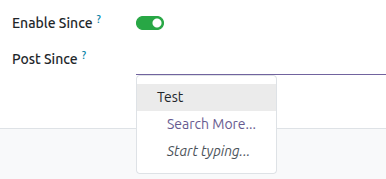

Nothing has to be configured for this module: it reads X with the credentials
the account already holds, which are configured in *Social Media X*.

What those credentials need is a **paid plan**, the same one the connector
requires: the timeline of the user and the recent search this module spends
are X API v2 endpoints, so a developer App outside a Project answers ``403``
to them as it does to the rest. See the configuration of *Social Media X* and
[the pricing of the X API](https://docs.x.com/x-api/getting-started/pricing).

Enable since
------------------------
- Go to *Social Media* > Configuration > Accounts
- Select the account
- Select *Enable since*
- The *Post since* field is then enabled, allowing you to
  select the post to start the search for in the next post
  retrieval. Note that metrics for older posts will not be updated
  if this option is selected.

  

Scheduled actions
------------------------

The passes over an X account are the ones *Social Media Sync* declares, plus
the check for updates of *Social Media Base*:

- *Check media updates*, every 2 hours, reads the timeline of every X account.
  X has no cheap answer to whether anything moved — the only endpoint that
  knows is the timeline, and reading it is already the import — so this pass
  imports instead of flagging the account.
- *Initial sync of the new accounts*, monthly, imports the timeline of an
  account that was just linked. Linking one triggers this action immediately
  as well, so its card is filled from the first moment.
- *Full resync*, weekly, is the only pass that notices a publication deleted
  on X.

An account whose first import has not run yet is left out of the bihourly
check, because that check and the initial import write the same row from two
threads.
